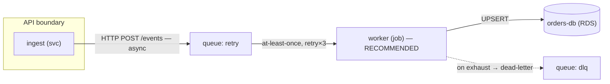

# Mermaid Guide for Implementation Comparison

Diagnose the dominant dimension of the decision, then pick the diagram shape that carries it. Label nodes and edges with real terms from the inspected code, never invented ones.

## Pick a shape

- **Component topology / data flow** — `flowchart TD` or `flowchart LR`. Nodes are components or deployment units; edges carry the payload and protocol. Use `subgraph` for boundaries (account, service, DB, network).
- **Control flow / request lifecycle / failure paths** — `sequenceDiagram`. Shows ordering, sync vs async, and where the flow stalls or retries.
- **Physical infrastructure** — `flowchart` or `graph` with regions/racks shown as subgraphs when spatial truth matters.

## Conventions

- **Node label**: `component (deployment-unit)`, e.g. `worker (GHA job)` or `orders-db (RDS)`.
- **Edge label**: `protocol + payload`, then `sync` or `async`, retry when present — e.g. `HTTP POST /events — async, retry×3`.
- **Queues / integrators**: give them nodes, not invisible edges. `topic: orders` or `queue: retry`.
- **Failure / fallback paths**: solid edge for the happy path, dashed edge for degradation.
- **Boundaries**: wrap related nodes in a `subgraph` and name the seam (API, DB, event, module).
- **Retries / idempotency / backpressure**: annotate on the edge or a note node: `idempotency-key`, `at-least-once`, `DLQ`.

## What the visual must carry

- **Recommendation marker**: label the recommended option literally `RECOMMENDED` — as a node label, subgraph title, or note attached to that option. Use it only when the option passes every hard constraint and no shown failure path, assumption, or unknown can violate a hard constraint (self-audit before final output). If one can, remove `RECOMMENDED` and mark the option `INVALID` or `UNPROVEN` with the affected constraint. Do not rely on color or position alone.
- **Invalid options**: label any option that fails a hard constraint literally `INVALID` and name the constraint it failed, on that option's node or subgraph. Mark an option whose pass/fail is unresolved by a shown ambiguity or assumption `UNPROVEN` with the affected constraint.
- **Deciding constraint**: show the constraint the winner satisfies that the others fail — on the recommended node or as a note node.
- **Each option's failure/recovery path**: for every option shown, include its degradation edge (dashed) so the alternatives and the failure modes share the picture.

## Minimal comparison pattern

Prefer one shared comparison diagram. When options differ structurally, show them as aligned lanes or parallel subgraphs inside a single Mermaid block. Split into separate Mermaid blocks only when one block would be unreadable.

Keep one diagram focused on the decision. Resist adding every component; show only what changes between options plus the shared skeleton.
